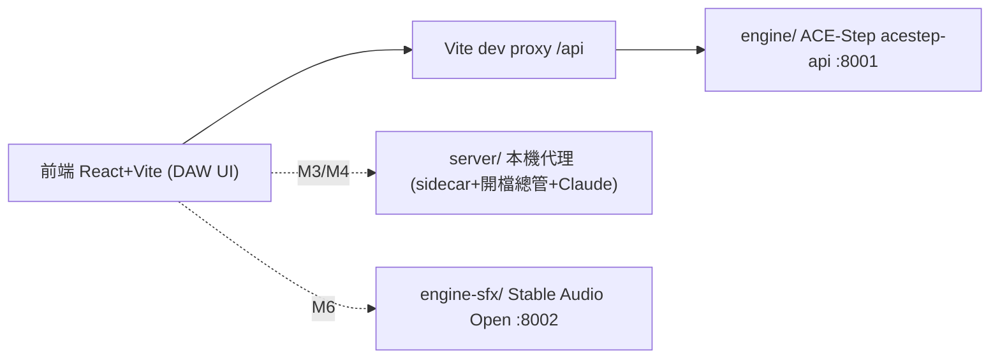
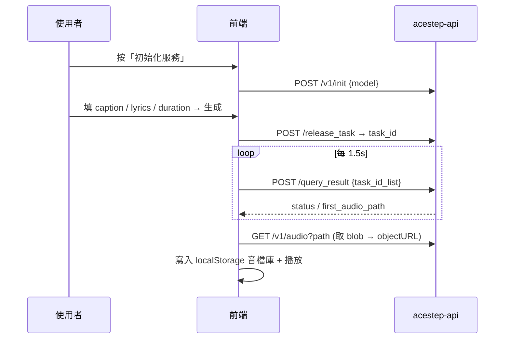

# ACE Studio 前端實作計畫

## Goal

把已完成的設計稿與規格，實作成一個可用的本地工具：**深色音樂工作站 (DAW) 風格介面**，用文字產生**遊戲 BGM**（ACE-Step）與**短音效 SFX**（Stable Audio Open）。最終目標是「打開面板就能產出遊戲要的音樂與音效，也能用 AI 助手用講的下需求」。

本計畫先把 **M1（走通單首 BGM 生成）** 做到可用，再依路線圖逐步加上批次、模板、AI 助手、SFX 引擎等。

## 現況（已完成）

- **Repo**：`github.com/ddwolfer/ACE_Studio`（main 已推送，`engine/` 不進版控）。
- **引擎就緒**：`engine/` = ACE-Step 1.5 XL，已下載 `acestep-v15-xl-turbo` 模型，venv 驗證 `import acestep, torch` OK、**CUDA True**（RTX 4060 8GB）。
- **設計稿**：`frontend.pen`（單首生成含 AI 助手 / 批次 / 定時 / 模板 / 設定 + 狀態變體板）。
- **規格**：`docs/FRONTEND-SPEC.md`、`docs/IMPLEMENTATION-SPEC.md`（含**已確認的 acestep-api 端點**）、`docs/SFX-ENGINE.md`。
- **產品決策**：BGM = ACE-Step；SFX 預設 = Stable Audio Open（備案 AudioGen）；prompt 合成 = `基底 + 額外`；每首須記錄完整 prompt。

## 架構

## 技術選型

| 項目 | 選擇 | 理由 |
|------|------|------|
| 框架 | React 18 + Vite + TypeScript | 快、對接設計稿直接 |
| 樣式 | Tailwind CSS（用 FRONTEND-SPEC §2 配色 token） | DAW 深色一致 |
| 狀態 | Zustand | 輕量多面板共享 |
| 波形/播放 | wavesurfer.js | 現成波形 + 游標 |
| 抓取/輪詢 | TanStack Query | 內建 polling/retry |
| 圖示 | lucide-react | 與設計稿同套 |
| 本機代理（M3+） | Node + Express | 與前端同生態；開檔總管用 child_process；之後接 Claude |

---

## M1 — 走通單首 BGM 生成（本次交付）

**範圍**：純前端 + Vite dev proxy 直連引擎。**M1 不做** server / sidecar 寫檔 / 批次 / 模板 / AI 助手 / SFX。音檔庫先用 **localStorage** 記錄（含完整 prompt metadata，符合記錄契約，只是先不落地成 `library.json`）。

### 生成流程

### 步驟

1. **Scaffold**：`frontend/` 建 Vite + React + TS；裝 Tailwind、zustand、@tanstack/react-query、wavesurfer.js、lucide-react。把 FRONTEND-SPEC §2 配色/字體設成 Tailwind theme tokens。
2. **Dev proxy**：`vite.config.ts` 設 `/api → http://127.0.0.1:8001`（順便解 CORS 與 `<audio>` 授權；引擎本機不設 api key）。
3. **API client**（`src/api/acestepClient.ts`）：包 `init()`、`releaseTask()`、`queryResult()`、`audioUrl()`；統一解開 `wrap_response` 外層（先打一次 `/v1/models` 確認鍵名）。
4. **Stores**（zustand）：`serviceStore`（模型/初始化狀態/GPU stats）、`genStore`（表單 base/extra/lyrics/params、生成中進度、目前曲目）、`libraryStore`（localStorage 音檔清單）。
5. **UI（最小骨架，套設計稿）**：
   - `TopBar`：模型下拉、服務狀態燈、`初始化服務` 按鈕。
   - `SingleGen`：曲風(caption)、純音樂 toggle、歌詞、長度滑桿（**下限 5s**）、`生成音樂` 按鈕（生成中顯示進度）。
   - `TransportBar`：wavesurfer 播放器 + `打開本地目錄`(M3 接 server，M1 先停用/灰)、`複製 prompt`(M1 可複製 final_caption)。
   - `Library`：localStorage 清單，點播放。
6. **Wiring 生成流程**：init → release_task → 輪詢 query_result（TanStack Query）→ 取 `/v1/audio` blob → 播放 + 寫 library（含 `final_caption / base / extra / lyrics / params / created_at`）。
7. **Prompt 合成**（`src/lib/promptCompose.ts`）：`prompt = base + (", " + extra)`；送出前組好，UI 顯示 final。

### M1 完成定義（Definition of Done）

- [ ] `npm run dev` 起得來，畫面是設計稿的深色三欄骨架
- [ ] 啟動 `run-engine.ps1`，前端按「初始化服務」→ 狀態燈變「就緒」
- [ ] 填「epic orchestral battle, war drums, 140 BPM」+ 純音樂 + 60s → 生成
- [ ] 生成中有進度、完成後播放器可播放該音樂
- [ ] 音檔出現在右側音檔庫，重整後仍在（localStorage）
- [ ] 該筆記錄含完整 prompt 與 params（`複製 prompt` 可複製出 final_caption）
- [ ] 長度滑桿最小 5s（避免 ACE-Step 長度底線問題）

---

## 路線圖（M1 之後）

| 里程碑 | 內容 |
|--------|------|
| **M2** | 場景範本一鍵帶入 + 我的模板 + 批次生成（序列化佇列，因 workers=1） |
| **M3** | 本機 server（Express）：`library.json` 落地、`打開本地目錄`(explorer /select)、`複製 prompt`；設定 modal 串 `/v1/init` 進階參數 |
| **M4** | AI 助手：Claude API tool-use（`fill_single_form`/`queue_batch`/`save_template`）→ 動作卡 |
| **M5** | 定時排程：server 端 node-cron（UI 標明需保持開啟） |
| **M6** | SFX 引擎：`engine-sfx/` 接 Stable Audio Open（diffusers，:8002）+ BGM/SFX 類型切換；備案 AudioGen |

---

## Out of scope（M1 明確不做）

- 本機 server / `library.json` 落地（M3）
- 批次 / 定時 / 模板 / 設定進階（M2、M3、M5）
- AI 助手聊天（M4）
- SFX 引擎與類型切換（M6）
- 響應式 / 行動版
- 引擎 api key 驗證（本機開發不設）

## 已拍板決策（2026-06-09 approved）

1. **M1 音檔庫用 localStorage** ✅（metadata 完整記錄；落地 `library.json` 放 M3）。
2. **本機代理用 Node(Express)** ✅（M3 起）。
3. **執行模式：連續做下去，直到遇到需使用者手動驗證的點才回報。** 第一個手動驗證點 = M1 末（需啟動引擎 + `npm run dev` + 瀏覽器生成 + 試聽）。AI 把 M1 程式碼寫到可編譯後停下交付驗證；驗證通過再續做 M2+。

## 風險 / 待確認（實作時先驗）

- **單併發**：引擎 workers=1，批次要序列化（M2 處理）；M1 單首不受影響。
- **`wrap_response` 外層鍵名**：先打一次 `/v1/models` 確認 `{code,data,error}` 真實欄位再寫 client。
- **`query_result` 狀態字面值**：實際 queued/running/succeed/failed… 以打一次為準（對照 `engine/acestep/api/jobs/store.py`）。
- **`/v1/audio` 授權**：M1 引擎不設 key，直接用 URL；之後若設 key 改 blob+header 或 proxy 注入。
- **8GB 顯存**：turbo + 自動 offload；長度先 60s 內測試。
