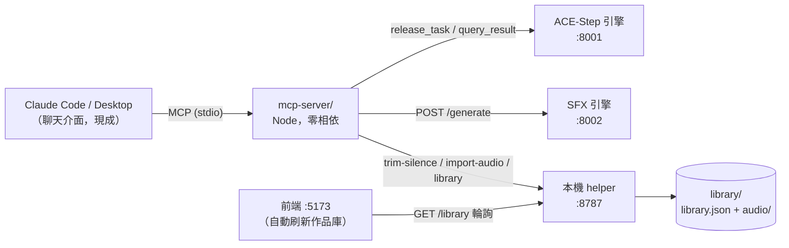

## 目標

讓 AI 能驅動 ACE Studio 的完整生成管線：用自然語言下單（「幫我做一套 8-bit 風格音效包：金幣、跳躍、受傷各 2 個變化」），AI 自動拆解任務、寫好英文 prompt、呼叫 BGM/SFX 引擎、結果自動裁切並進作品庫——app 打開就看得到。

同時回答「外部 AI 怎麼打 API 進來生成」：給一個標準接口，任何支援該協定的 AI 都能接。

## 兩條路線比較（你問的兩個方向）

| | A. App 內建聊天面板 | B. MCP 接口（推薦先做） |
|---|---|---|
| 聊天介面 | 自己刻（聊天 UI、串流、歷史） | **現成**——Claude Code / Claude Desktop 就是介面 |
| Agent 能力 | 自己寫 tool-use 迴圈、錯誤重試 | **現成**——Claude Code 原生會規劃多步任務 |
| 費用 | 需 Anthropic API key，按 token 計費 | **零額外費用**（用你既有的 Claude Code 訂閱） |
| 外部 AI 接入 | 否（只服務這個 app） | **是**——MCP 是業界標準，Claude/Cursor/其他客戶端都能掛 |
| 開發量 | 大（UI + key 管理 + agent 迴圈 + proxy） | 小（一個 Node MCP server，重用既有三服務） |
| 體驗 | 一體化，在 app 內完成 | 聊天發生在 Claude Code，app 負責看結果/播放 |

**結論：先做 B。** A 不是被否決，而是延後——MCP server 的工具層做好之後，內建聊天（M5b）只是「換一個呼叫這些工具的前端」，到時想做隨時能加，不用重構。

## 架構

關鍵：**MCP server 不繞過既有管線**。生成 → 自動裁切 → 落地 `library/audio/` → 寫 `library.json`，跟你在 UI 按按鈕走的是同一套流程，所以 app 一刷新就看得到 AI 生的東西。

## MCP 工具設計（5 個）

| 工具 | 參數 | 行為 |
|------|------|------|
| `generate_bgm` | prompt, duration(5–120), lyrics?, instrumental?=true, model? | release_task → 輪詢 query_result → 裁切 → 入庫，回傳 item（含本機播放 URL） |
| `generate_sfx` | prompt, duration(0.5–8), seed? | :8002 /generate → 裁切 → 入庫，回傳 item |
| `list_library` | type?(bgm/sfx) | 回傳作品清單（id、標題、prompt、長度、路徑） |
| `remove_item` | id | 從 library.json 移除 + 刪音檔 |
| `studio_status` | — | 三服務健康 + 已載入模型 + VRAM 提示（給 AI 判斷要不要先提醒你開服務） |

設計原則：

- **同步等待**：BGM 一首約 1–2 分鐘，工具直接等到完成才回傳（Claude 會耐心等）；engine `workers=1`，多首請求自然排隊，AI 想做「音效包」就是連續呼叫多次。
- **VRAM 自動管理**：`generate_bgm` 前自動打 `/sfx/release`（沿用 M4 收尾的策略），反向不用（SFX 是 offload 模式）。
- **入庫即所見**：寫完 library.json 後，前端靠輪詢 `updatedAt` 自動刷新（見步驟 4）。

## 步驟

1. **`mcp-server/index.mjs`**：Node + `@modelcontextprotocol/sdk`（唯一新相依），stdio transport；包上面 5 個工具，內部全部走 127.0.0.1 既有端點。
2. **入庫管線重用**：抽不出共用程式碼也沒關係——helper 的 `/trim-silence`、`/library/import-audio`、`GET/POST /library` 都是現成 HTTP 端點，MCP server 直接打。
3. **`.mcp.json`**（專案根目錄）：註冊 `ace-studio` MCP server，Claude Code 在這個專案目錄打開時自動載入工具。
4. **前端作品庫自動刷新**：libraryStore 加輕量輪詢（每 5 秒 `GET /library`，比對 `updatedAt`，變了才更新 state；視窗不在前景時暫停）。這樣 AI 生完，app 不用手動重新整理。
5. **文件 + 驗收**：README 加「用 Claude Code 操作」一節；spec §12 標 M5a；端到端驗收 = 在 Claude Code 說「幫我生成一套 8-bit 音效：金幣、跳躍、受傷」，三個音效自動出現在 app 作品庫。

驗收清單：

- [ ] Claude Code 內 `/mcp` 看得到 ace-studio 的 5 個工具
- [ ] `generate_sfx` 單發 → app 作品庫 5 秒內自動出現
- [ ] `generate_bgm` 60 秒曲 → 裁切後入庫、可播放
- [ ] 自然語言「一套音效包」→ AI 自動連續呼叫多次、全部入庫
- [ ] 服務沒開時工具回清楚錯誤訊息（不是 timeout 掛死）

## Out of scope

- **App 內建聊天 UI（M5b）**：延後待定；屆時重用同一套工具層。
- **遠端存取／鑑權**：全部綁 127.0.0.1，不對外網開放（要對外再議）。
- **批次並行**：engine workers=1，排隊即可，不做並行調度。

## Open questions

1. **你平常想在哪裡下指令？** 如果 Claude Code 終端機對你來說夠順手，B 方案就是完整答案；如果你強烈想要「app 裡有個聊天框」，我把 M5b 排進來（會需要你出一個 Anthropic API key，費用大約每次對話幾美分）。
2. **工具要不要加 `regenerate(id, feedback)`**？例如「金幣聲再亮一點」→ AI 拿舊 prompt 改寫重生並標記取代舊檔。第一版可以先不做，靠 AI 自己 list_library 拿舊 prompt 改。